# Sistema de Gestão para Consultório Médico
## Java EE + Quarkus + JAX-RS + JPA/Hibernate + HTML/CSS/JS

---

## Pré-requisitos
- Java 17+
- Maven 3.8+

## Como executar (modo desenvolvimento)

```bash
cd consultorio-web
mvn quarkus:dev
```

Acesse: http://localhost:8080

---

## Usuários de demonstração (senha: `123456`)

| E-mail                    | Perfil         |
|---------------------------|----------------|
| admin@consultorio.com     | ADMIN          |
| carlos@consultorio.com    | MÉDICO         |
| ana@consultorio.com       | MÉDICO         |
| maria@consultorio.com     | RECEPCIONISTA  |

---

## Endpoints REST (JAX-RS)

| Método | Endpoint                        | Permissão              | Descrição                        |
|--------|---------------------------------|------------------------|----------------------------------|
| POST   | /api/auth/login                 | Público                | Autenticação (retorna JWT)       |
| GET    | /api/pacientes                  | ADMIN, MEDICO, RECEP.  | Listar pacientes                 |
| POST   | /api/pacientes                  | ADMIN, RECEPCIONISTA   | Cadastrar paciente               |
| PUT    | /api/pacientes/{id}             | ADMIN, RECEPCIONISTA   | Editar paciente                  |
| DELETE | /api/pacientes/{id}             | ADMIN, RECEPCIONISTA   | Inativar paciente (soft delete)  |
| GET    | /api/consultas                  | ADMIN, MEDICO, RECEP.  | Listar consultas                 |
| POST   | /api/consultas                  | ADMIN, MEDICO, RECEP.  | Agendar consulta                 |
| PUT    | /api/consultas/{id}             | ADMIN, MEDICO, RECEP.  | Reagendar consulta               |
| PUT    | /api/consultas/{id}/status      | ADMIN, MEDICO, RECEP.  | Atualizar status                 |
| GET    | /api/fichas/paciente/{id}       | ADMIN, MEDICO, RECEP.  | Histórico de fichas do paciente  |
| POST   | /api/fichas                     | MEDICO                 | Registrar ficha de atendimento   |
| PUT    | /api/fichas/{id}                | MEDICO                 | Editar ficha                     |
| GET    | /api/medicos                    | ADMIN, MEDICO, RECEP.  | Listar médicos                   |
| POST   | /api/medicos                    | ADMIN                  | Cadastrar médico                 |
| GET    | /api/usuarios                   | ADMIN                  | Listar usuários                  |
| POST   | /api/usuarios                   | ADMIN                  | Criar usuário                    |
| PUT    | /api/usuarios/{id}              | ADMIN                  | Editar usuário                   |
| DELETE | /api/usuarios/{id}              | ADMIN                  | Inativar usuário                 |
| GET    | /api/usuarios/perfis            | Autenticado            | Listar perfis de usuário         |
| GET    | /api/auditoria                  | ADMIN                  | Log de auditoria                 |

---

## Arquitetura

```
consultorio-web/
├── src/main/java/br/com/consultorio/
│   ├── config/           # CorsFilter
│   ├── security/         # JwtUtil, AuthService, UsuarioLogado
│   ├── model/
│   │   ├── entity/       # Usuario, Paciente, Medico, Consulta, FichaAtendimento, LogAcao, PerfilUsuario
│   │   ├── dao/          # UsuarioDAO, PacienteDAO, MedicoDAO, ConsultaDAO, FichaAtendimentoDAO, LogAcaoDAO
│   │   ├── bo/           # UsuarioBO, PacienteBO, MedicoBO, ConsultaBO, FichaAtendimentoBO
│   │   ├── dto/          # LoginDTO, TokenDTO, PacienteDTO, AgendamentoConsultaDTO, FichaHistoricoDTO, ...
│   │   └── util/         # AuditoriaBO
│   └── resource/         # AuthResource, PacienteResource, ConsultaResource, FichaAtendimentoResource,
│                         #   MedicoResource, UsuarioResource, AuditoriaResource
└── src/main/resources/
    ├── META-INF/resources/
    │   ├── index.html            # Tela de login
    │   ├── css/style.css
    │   ├── js/auth.js, api.js, utils.js
    │   └── pages/
    │       ├── dashboard.html    # Dashboard com estatísticas
    │       ├── pacientes.html    # Gestão de pacientes + histórico
    │       ├── consultas.html    # Agendamento de consultas
    │       ├── fichas.html       # Fichas de atendimento médico
    │       ├── usuarios.html     # Gestão de usuários (ADMIN)
    │       └── auditoria.html    # Log de auditoria (ADMIN)
    ├── application.properties
    └── import.sql                # Dados iniciais
```

---

## Casos de Uso Implementados

### Caso de Uso 1 — Agendamento e Gestão de Consultas
- **Quem pode usar:** Recepcionista e Médico (agendar/reagendar/cancelar), todos os perfis (visualizar)
- **Regras de negócio (ConsultaBO):**
  - Data/hora deve ser futura
  - Verifica conflito de horário do médico (±30 min)
  - Status possíveis: AGENDADA, REALIZADA, CANCELADA, FALTA

### Caso de Uso 2 — Ficha de Atendimento Médico
- **Quem pode usar:** Apenas MÉDICO pode registrar/editar fichas
- **Regras de negócio (FichaAtendimentoBO):**
  - Médico só pode preencher ficha das suas próprias consultas
  - Ao registrar ficha, a consulta é automaticamente marcada como REALIZADA
  - Histórico completo acessível por paciente

### Auditoria (Requisito 6)
- Todas as ações são registradas via `AuditoriaBO.registrar()`
- ## 📸 Capturas de Tela do Sistema

### 🔐 Tela de Login
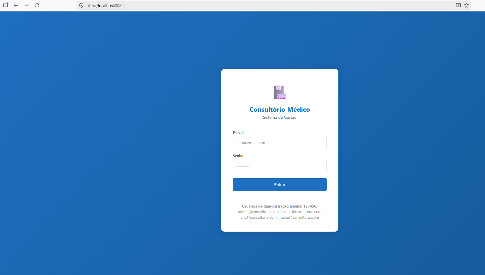

---

### 👨‍💼 Dashboard do Administrador
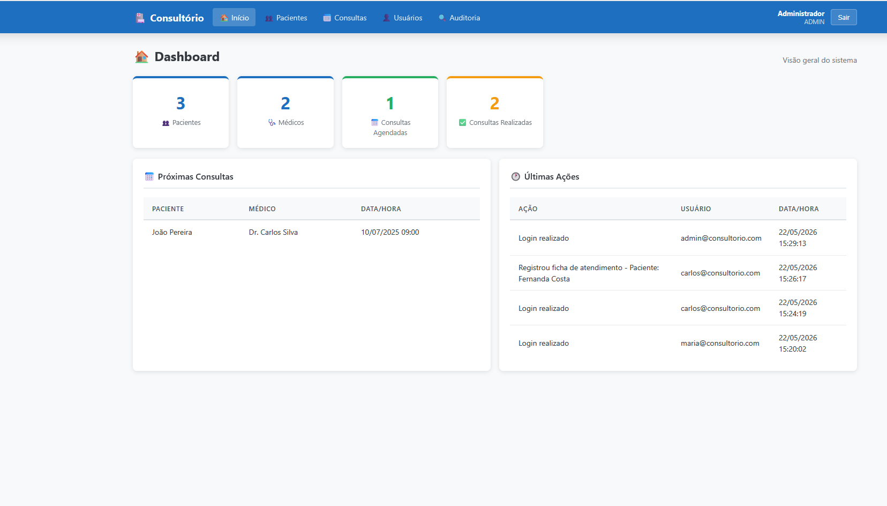

### 👥 Gerenciamento de Usuários (Admin)
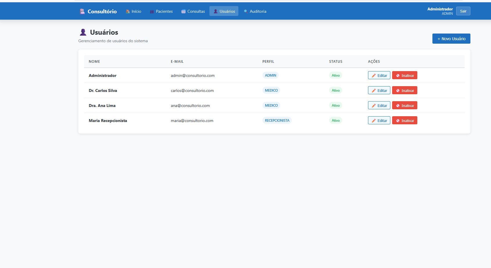

### 📜 Log de Auditoria (Admin)
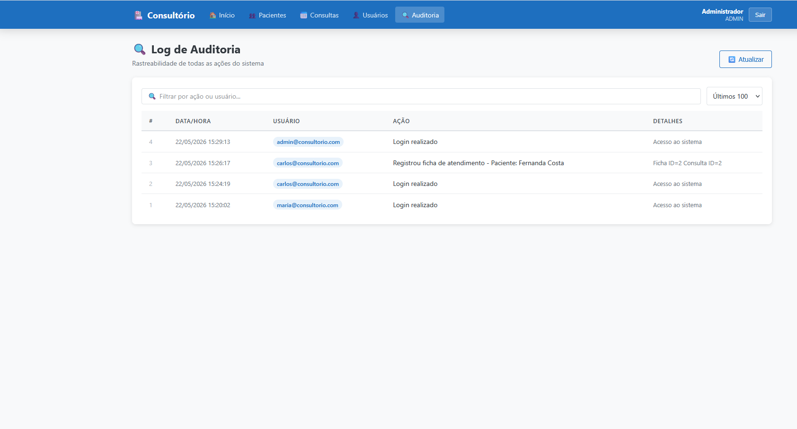

---

### 🩺 Dashboard do Médico
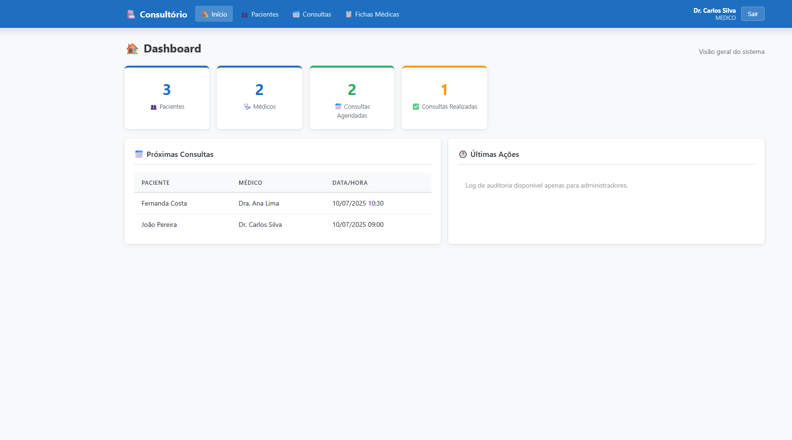

### 📅 Consultas (Médico)
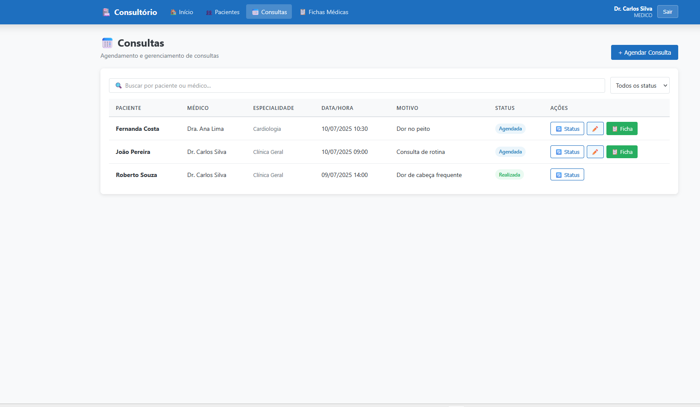

### 📝 Registrar Atendimento – Formulário
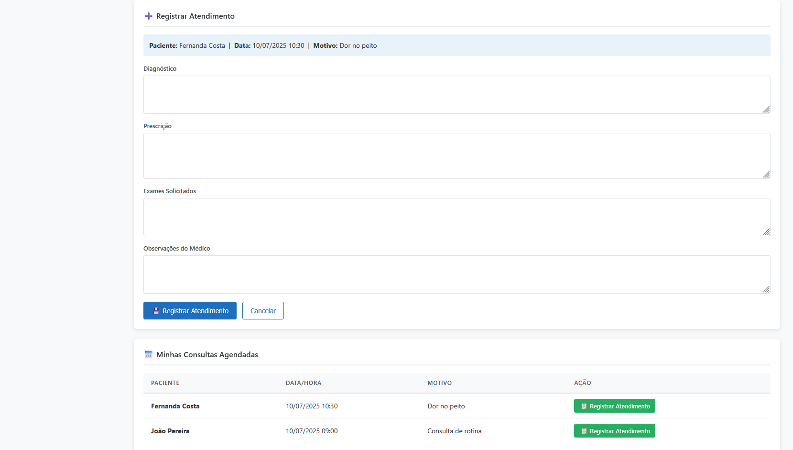

### 📋 Registrar Atendimento – Preenchido
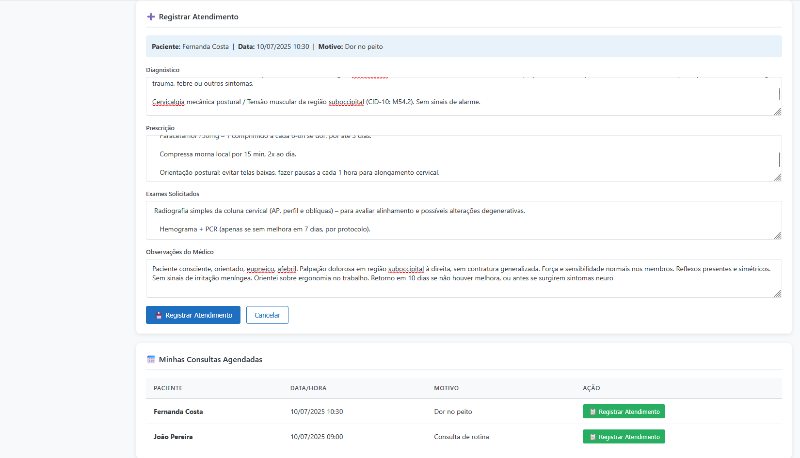

### 📂 Fichas de Atendimento (Médico)
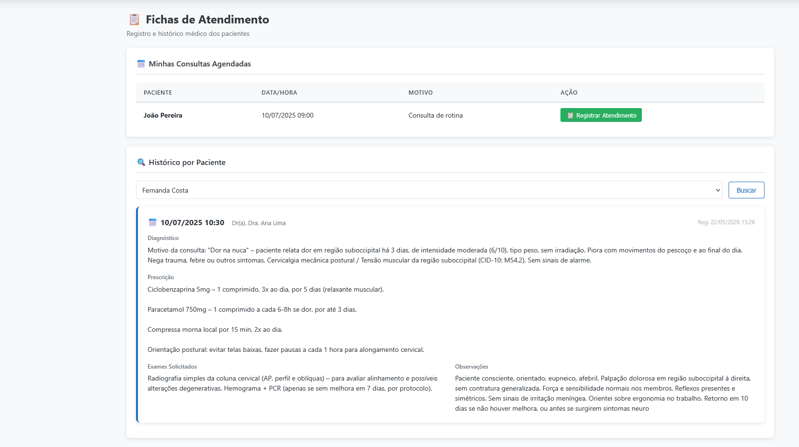

### 🔍 Consultas com Filtro (Médico)
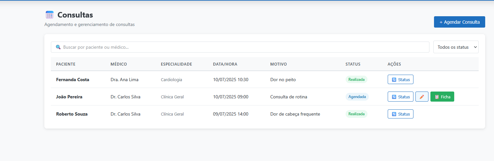

---

### 🧾 Dashboard da Recepcionista
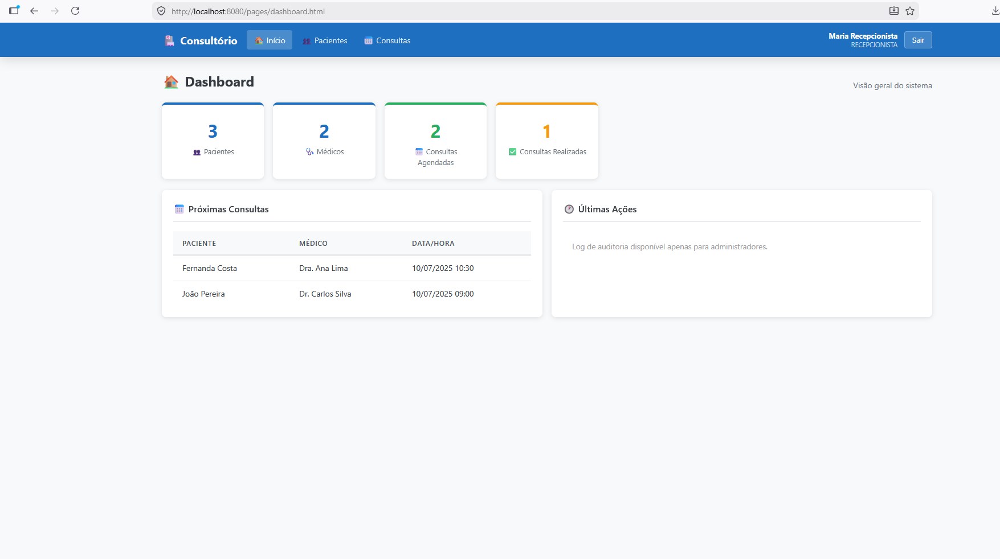

### 👤 Listagem de Pacientes (Recep)
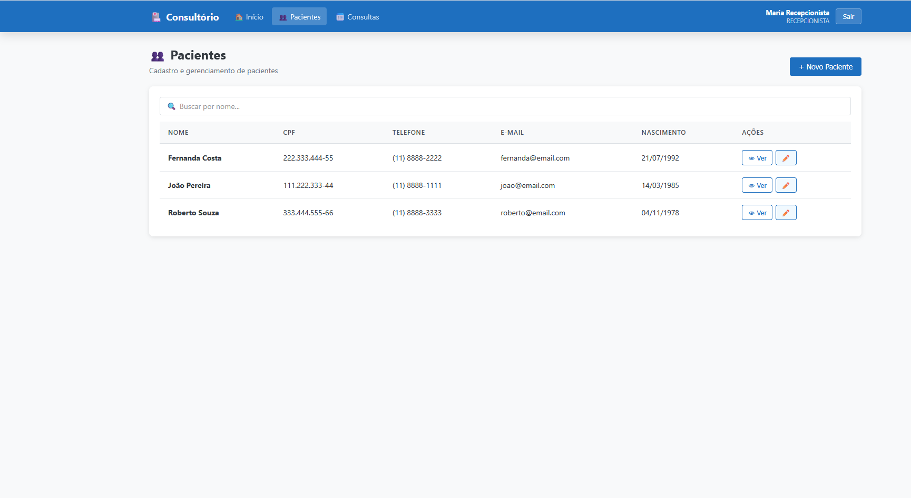

### 🔎 Detalhes do Paciente (Recep)
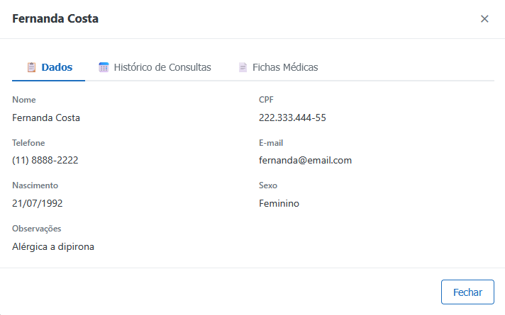

### ⚙️ Consultas (Recep)
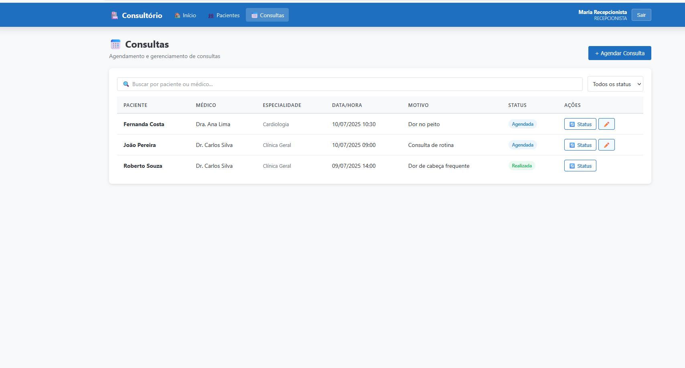

### 🔄 Atualizar Status (Recep)
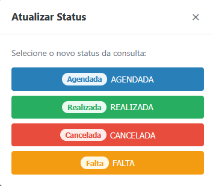

### 📅 Reagendar Consulta (Recep)
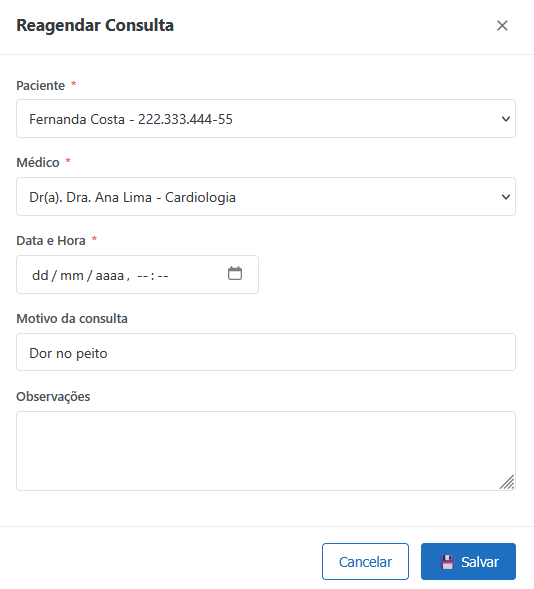
- Campos: ação, usuário executor (email + ID), data/hora
- Visível apenas para ADMIN em /pages/auditoria.html
